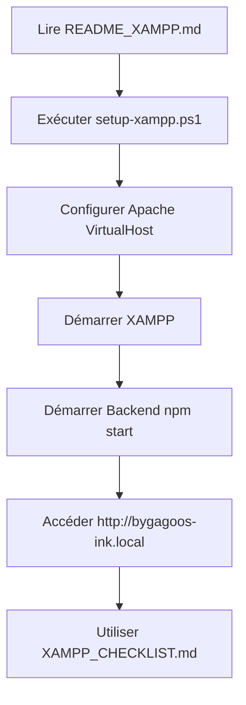
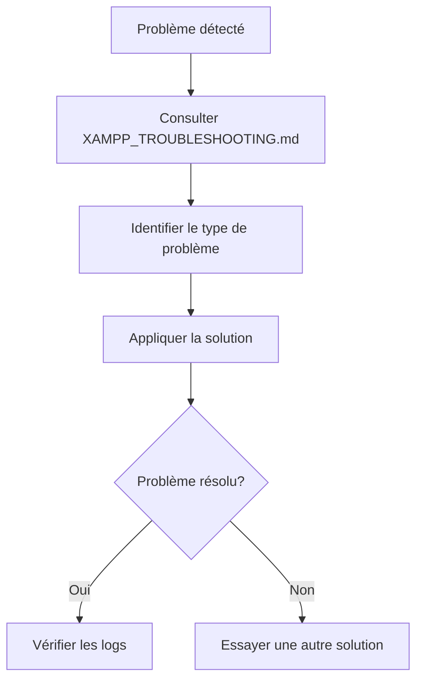
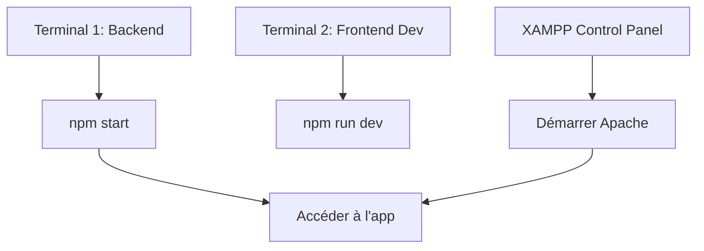

# 📖 Index de Documentation - ByGagoos-Ink XAMPP

> Tous les fichiers de configuration et documentation pour déployer ByGagoos-Ink sur XAMPP

## 🚀 Démarrer Rapidement

**Nouveau sur ce projet?** Commencez ici:

1. **Lire**: [`README_XAMPP.md`](./README_XAMPP.md) - Vue d'ensemble (5 min)
2. **Résumé**: [`XAMPP_SETUP_SUMMARY.md`](./XAMPP_SETUP_SUMMARY.md) - Ce qui a été créé (3 min)
3. **Setup**: Exécuter `.\setup-xampp.ps1` (10 min)

---

## 📚 Guide Complet

### Pour l'Installation

| Document | Durée | Contenu |
|----------|-------|---------|
| 📖 [README_XAMPP.md](./README_XAMPP.md) | 10 min | Vue d'ensemble, démarrage rapide, architecture |
| 📋 [XAMPP_SETUP.md](./XAMPP_SETUP.md) | 30 min | Installation détaillée, étape par étape |
| 🗂️ [docs/DATABASE_XAMPP.md](./docs/DATABASE_XAMPP.md) | 20 min | Configuration base de données |

### Pour la Vérification

| Document | Durée | Contenu |
|----------|-------|---------|
| ✅ [XAMPP_CHECKLIST.md](./XAMPP_CHECKLIST.md) | 15 min | Checklist pré-déploiement |
| 🧪 [XAMPP_TROUBLESHOOTING.md](./XAMPP_TROUBLESHOOTING.md) | À besoin | Dépannage et solutions |

### Pour la Maintenance

| Document | Durée | Contenu |
|----------|-------|---------|
| 📊 [docs/DATABASE_XAMPP.md](./docs/DATABASE_XAMPP.md) | 20 min | Migrations, backups, maintenance BD |

---

## 🛠️ Scripts de Configuration

### Démarrage Automatisé

```powershell
# Windows - PowerShell (RECOMMANDÉ)
.\setup-xampp.ps1

# Windows - Batch
.\setup-xampp.bat

# Linux/Mac/Git Bash
bash setup-xampp.sh

# Menu interactif
bash quickstart.sh
```

### Démarrage du Backend

```bash
# Windows
cd backend
npm start

# Ou avec le script fourni
.\backend\start-xampp.bat
```

---

## 📁 Structure de Fichiers

```
ByGagoos-Ink/
│
├── 📖 README_XAMPP.md                ← COMMENCER ICI
├── 📖 XAMPP_SETUP_SUMMARY.md         ← Résumé des modifications
├── 📖 XAMPP_SETUP.md                 ← Guide détaillé
├── ✅ XAMPP_CHECKLIST.md             ← Checklist pré-production
├── 🐛 XAMPP_TROUBLESHOOTING.md       ← Dépannage
│
├── 🛠️ Scripts:
│   ├── setup-xampp.ps1               ← Setup Windows (PowerShell)
│   ├── setup-xampp.bat               ← Setup Windows (Batch)
│   ├── setup-xampp.sh                ← Setup Linux/Mac
│   └── quickstart.sh                 ← Menu interactif
│
├── 🔧 Configuration:
│   ├── config/apache-vhosts.conf     ← Config Apache (à copier)
│   ├── backend/.env.production       ← Config production
│   └── backend/.env.xampp.local      ← Config dev local
│
├── 📚 Documentation:
│   └── docs/DATABASE_XAMPP.md        ← Guide BD détaillé
│
├── 🎨 Frontend:
│   ├── frontend/vite.config.js
│   ├── frontend/src/context/AuthContext.jsx
│   └── frontend/package.json
│
└── ⚙️ Backend:
    ├── backend/app.js
    ├── backend/package.json
    ├── backend/prisma/schema.prisma
    └── backend/start-xampp.bat
```

---

## 🎯 Scénarios d'Utilisation

### Scénario 1: Installation Complète (1ère fois)



### Scénario 2: Troubleshooting



### Scénario 3: Développement Local



---

## ⚡ Raccourcis Utiles

### Commandes Fréquentes

```bash
# Setup
.\setup-xampp.ps1

# Build frontend
cd frontend && npm run build

# Démarrer backend
cd backend && npm start

# Ouvrir Prisma Studio
cd backend && npm run prisma:studio

# Seeder la base
cd backend && npm run prisma:seed

# Tests de connexion
curl http://localhost:3001/api/health
curl http://localhost
```

### Fichiers à Éditer

| Fichier | Raison | Accès |
|---------|--------|-------|
| `backend/.env` | Variables d'environnement | Avant démarrage |
| `config/apache-vhosts.conf` | Configuration Apache | Copier vers XAMPP |
| `frontend/vite.config.js` | Config dev/build | Si changements ports |
| `frontend/src/context/AuthContext.jsx` | URL API | Si changement port 3001 |

---

## 🔍 Recherche Rapide

### Par Type de Problème

| Problème | Voir |
|----------|-----|
| Port occupé | XAMPP_TROUBLESHOOTING.md #1 |
| CORS errors | XAMPP_TROUBLESHOOTING.md #2 |
| Erreur BD | XAMPP_TROUBLESHOOTING.md #3 |
| Frontend 404 | XAMPP_TROUBLESHOOTING.md #4 |
| Auth échoue | XAMPP_TROUBLESHOOTING.md #5 |
| Images cassées | XAMPP_TROUBLESHOOTING.md #6 |
| Apache ne démarre pas | XAMPP_TROUBLESHOOTING.md #7 |
| Node modules manquants | XAMPP_TROUBLESHOOTING.md #8 |
| Erreur Prisma | XAMPP_TROUBLESHOOTING.md #9 |
| Erreur SSL | XAMPP_TROUBLESHOOTING.md #10 |

### Par Composant

| Composant | Documentation |
|-----------|---------------|
| **Apache** | XAMPP_SETUP.md sections 1-4 |
| **Node.js Backend** | XAMPP_SETUP.md sections 3, backend/.env |
| **React Frontend** | XAMPP_SETUP.md sections 5-6 |
| **PostgreSQL** | docs/DATABASE_XAMPP.md |
| **MySQL** | docs/DATABASE_XAMPP.md |
| **Authentification** | XAMPP_SETUP.md section 6 |

---

## ✅ Statut de Complétude

### Documentation
- ✅ Guide principal (README_XAMPP.md)
- ✅ Installation détaillée (XAMPP_SETUP.md)
- ✅ Checklist (XAMPP_CHECKLIST.md)
- ✅ Troubleshooting (XAMPP_TROUBLESHOOTING.md)
- ✅ Base de données (DATABASE_XAMPP.md)
- ✅ Résumé (XAMPP_SETUP_SUMMARY.md)

### Scripts
- ✅ PowerShell setup (setup-xampp.ps1)
- ✅ Batch setup (setup-xampp.bat)
- ✅ Bash setup (setup-xampp.sh)
- ✅ Quickstart menu (quickstart.sh)
- ✅ Backend starter (backend/start-xampp.bat)

### Configuration
- ✅ Apache VirtualHost (config/apache-vhosts.conf)
- ✅ .env production (backend/.env.production)
- ✅ .env dev local (backend/.env.xampp.local)

---

## 🎓 Guide Pédagogique

### Pour les Débutants

1. Lire: `README_XAMPP.md` - Comprendre l'architecture
2. Exécuter: `setup-xampp.ps1` - Installation automatique
3. Consulter: `XAMPP_SETUP.md` - Explication détaillée
4. Vérifier: `XAMPP_CHECKLIST.md` - Tout fonctionne?

### Pour les Développeurs

1. Consulter: Architecture dans `README_XAMPP.md`
2. Éditer: Configuration dans `backend/.env`
3. Modifier: Code dans `backend/` et `frontend/`
4. Démarrer: `npm start` et `npm run build`
5. Déboguer: Consulter `XAMPP_TROUBLESHOOTING.md`

### Pour les Administrateurs

1. Lire: `XAMPP_SETUP.md` - Installation complète
2. Vérifier: `XAMPP_CHECKLIST.md` - Avant production
3. Monitorer: Logs Apache et Backend
4. Maintenir: `docs/DATABASE_XAMPP.md` - Backups et maintenance

---

## 📞 Support et Aide

### Ressources

- **XAMPP**: https://www.apachefriends.org/
- **Node.js**: https://nodejs.org/docs/
- **Apache**: https://httpd.apache.org/docs/
- **Prisma**: https://www.prisma.io/docs/
- **React**: https://react.dev/

### Aide Locale

1. Consulter XAMPP_TROUBLESHOOTING.md
2. Vérifier les logs: `C:\xampp\apache\logs\`
3. Tester les endpoints: `curl http://localhost:3001/api/health`

---

## 🚀 Prochaines Étapes

1. **Exécuter le setup**: `.\setup-xampp.ps1`
2. **Configurer Apache**: Copier VirtualHost
3. **Démarrer les services**: XAMPP + Backend
4. **Vérifier**: `XAMPP_CHECKLIST.md`
5. **Accéder**: http://bygagoos-ink.local

---

## 📅 Historique

- **v1.0** - 11 Décembre 2025 - Configuration XAMPP initiale
- **Mocks** - Suppression des données mockées
- **API** - Utilisation de vrais appels API

---

✅ **Bienvenue dans ByGagoos-Ink XAMPP!**

Consultez [`README_XAMPP.md`](./README_XAMPP.md) pour commencer.
